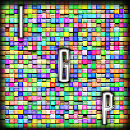
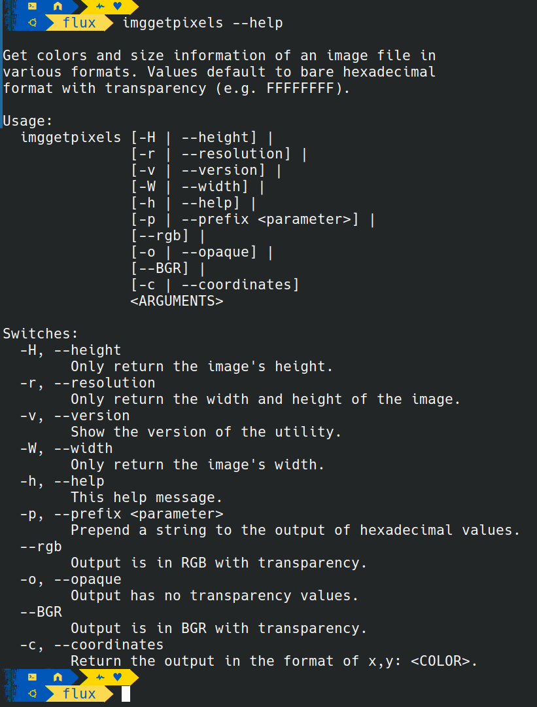

# Image Get Pixels  

[](https://github.com/Pranesh-2005/github-readme-stats)

<!-- ***This project is*** ![Under Construction](https://img.shields.io/static/v1?logo=data:image/png;base64,iVBORw0KGgoAAAANSUhEUgAAAA4AAAAOCAYAAAAfSC3RAAACmElEQVQokUWSa0iTcRTGn//26u4b6ZQ0U8lKMqykwPpgZVBEHyLp8jEoIZJADCQ0iCiStIwuZmHRioIuroQss2VkrkIrdeFckiZqdhctTXPOve8Tr7M6X8/zO+fwPEfIwy7IwQA0GgExGYQwyhCmMLRX1z2hJCJSN+xZgqAZnPgCaAUQ0EHICjSYLlKBCDdNQb7HLmeRoy3zQFnzYk/1WTckGUIXCVD+Kw+BpAxtuBXCpkN7bdXt/JL3W3J3xuHg3iTsL/NkNFWVPoWkQOj/wxooCrRhFgiTjI4n9ZVHHQObjxVEY8UGIi1zEhVFCahwdq5qvn+hHkKC0EcBigxwvAnkW3ge7L6TMi+VztOLOOKOY8ulKL68GM2emnjeLF3AZSlz2FCZ6yaHwLGv6pkv8MyxsUoHLcsLwAfHwE0rtdy2UuLWNTpmpkkszQEfnAPDAd47tbaB7NaJR+eXujfmtGTUXgFWp5uwPd8Oi1GBJEmwWYlP34L4PSFw7chPeD+MYnkWUVmy0CeNfe5N8ANIjNWpNmHzqklYrDIGRwRm2gXsM/xofRMOf1AgcbYOAfgxMvgxCmS9+dbh5A6VarxuIMdBDoJ0g+vSreytNpAEux7qqWrK82I+kC2xYOAzyFbz5QNJPrXhdRo4XK/n3WILkxPsbKqwsr8xBB3PjukhGyJJv+qqB+QvkN0mR2Fim5pU1hobzxTYOPbcyJoTNpoAlu6wdZKvIslR0O9VXe0Clc5p2Ge4WDh36ux3ThM/1RqnNhXvilU32cjvINtAf4cKdkzlSHpBTqgNY11JfLtFA+o14NU8Wx/piggNfg2yGVR8EF9/dP37PyCIoDQLs8z9hmv71nsC4wFz9klX2tD4/AEG+gBoQ7KghD8MZ2xdnt7s7wAAAABJRU5ErkJggg==&label=Under&message=Construction&style=for-the-badge&labelColor=1D1D1D&color=ffff99) and coming soon. -->

---

## About

Image Get Pixels is a lightweight, cross-platform command-line utility designed for extracting color and resolution information from image files. Built with modern C++ and leveraging the `stb_image` library, it provides an intuitive interface for querying image data through terminal commands.

### Description

Image Get Pixels offers a comprehensive set of features for image analysis, including:

- **Color Extraction**: Retrieve pixel colors in hexadecimal (RGB/RGBA) or comma-separated (RGB/BGR) formats.
- **Resolution Information**: Quickly get image dimensions (width and height) in a single command.
- **Flexible Formatting**: Support for opaque (no alpha) output and custom prefixes for hexadecimal values.
- **Coordinate Mapping**: Associate each pixel's color value with its exact x,y coordinates.
- **Cross-Platform Support**: Works seamlessly on Windows and Linux (Linux binary runs on MacOS, but images won't load when tested in Darling, if someone could verify that this works on a real modern Mac machine I'd appriciate it).

The utility is designed for developers, graphic designers, and power users who need a script-friendly way to inspect image data without opening heavy graphical software.

### Motivation

While image editing software provides pixel-level information, there is a lack of simple command-line tools for batch-processing or scripting image data queries. This project was born out of the need to:

- Automate the extraction of color palettes from images.
- Quickly verify image resolutions in terminal-based workflows.
- Provide a lightweight tool for developers to integrate image analysis into their build pipelines.
- Maintain high code quality and portability using modern C++ standards.

Image Get Pixels aims to be the go-to CLI tool for developers who value speed, simplicity, and precision when working with image files.

I also needed something to help me make compatible images for use with the ArtMap plugin in Minecraft. I already have tools, but this is more effecient.

---

## Usage

### Environment

Image Get Pixels is designed to work across multiple operating systems with minimal dependencies:

**Supported Platforms:**
- **Windows**: Windows 10/11 (x64)
- **Linux**: Most modern distributions (x64)
- **macOS**: macOS 10.15+ (x64) (not tested properly, needs confirmation as I do not touch Apple machines if I don't have to and haven't been around one I could use myself recently).

**Requirements:**
- C++20 compatible compiler (if building from source)
- CMake 3.16 or higher (if building from source)

**Build Dependencies (if building from source):**
- Windows: Visual Studio 2019+ or MinGW
- Linux: GCC 7+ or Clang 6+
- macOS: Xcode 10+ or Clang 6+ (not confirmed and Linux binary works a bit on MacOS).

### How To Use

Image Get Pixels uses a simple command-line syntax with intuitive switches and arguments.

**Basic Syntax:**
```bash
imggetpixels [OPTIONS] IMAGE_FILE
```

**Available Options:**
- `-h, --help` - Show help message
- `-v, --version` - Show the version of the utility
- `--rgb` - Output is in RGB with transparency (e.g., 255,127,0,0.1)
- `--BGR` - Output is in BGR with transparency
- `-o, --opaque` - Output has no transparency values (e.g., 7F3FAF)
- `-p, --prefix` - Prepend a string to hexadecimal values (e.g., -p "0x")
- `-c, --coordinates` - Return output in `x,y: <COLOR>` format
- `-r, --resolution` - Only return the width and height of the image
- `-W, --width` - Only return the image's width
- `-H, --height` - Only return the image's height

### Examples

**Basic Information:**
```bash
# Get image dimensions
imggetpixels --resolution my_image.png

# Get only image width
imggetpixels -W icon.jpg
```

**Color Extraction:**
```bash
# Get all pixel colors in hex format
imggetpixels my_image.png

# Get colors in RGB format with transparency
imggetpixels --rgb my_image.png

# Get opaque hex values with a "0x" prefix
imggetpixels -o -p "0x" logo.png
```

**Advanced Usage:**
```bash
# Map colors to coordinates
imggetpixels --coordinates screenshot.bmp

# Get BGR values for a specific image
imggetpixels --BGR texture.tga
```

**Help and Version:**
```bash
# Show help message
imggetpixels --help

# Show version
imggetpixels --version
```

---

## Project Information

This project is written in `C++`.

[![C++](https://img.shields.io/endpoint?url=https://raw.githubusercontent.com/Lateralus138/imggetpixels/master/docs/json/cpp.json&logo=data%3Aimage%2Fpng%3Bbase64%2CiVBORw0KGgoAAAANSUhEUgAAABAAAAAQCAMAAAAoLQ9TAAAABGdBTUEAALGPC%2FxhBQAAACBjSFJNAAB6JgAAgIQAAPoAAACA6AAAdTAAAOpgAAA6mAAAF3CculE8AAABcVBMVEUAAAAAgM0Af8wolNQAa7YAbbkAQIcAQIYAVJ0AgM0AgM0AgM0AgM0AgM0AgM0AgM0AgM0AgM0AgM0Af8wAfswAfswAf8wAgM0AgM0AgM0Af80AgM0AgM0AgM0AgM0Af8wAgM0Af80djtIIg84Af8wAfsxYrN4Fg84Gg85RqNwej9MLhM8LhM8AfcsAgM0Hg88AfsshkNNTqd1%2Fv%2BUXi9AHdsAAYKoAY64ih8kAf81YkcEFV54GV55Sj8EnlNULhc8AecYdebwKcrsAe8gAb7oAXacAXqgAcLwAImUAUpoAVJ0AUpwAUZoAIWMAVJ0AVJ0AUpwAUZwAVJ0AVJ0AVJ0AVJ0AgM0cjtJqteGczetqtOEAf807ndjL5fT9%2Fv7%2F%2F%2F%2FM5fQ9ntnu9vu12vCi0Oz%2F%2F%2F6Hw%2Bebzeufz%2Bx%2Bv%2BW12e%2Bgz%2BxqteLu9fmRx%2BjL3Ovu8%2Fi1zeKrzeUAUpw7e7M8fLQAU50cZ6hqm8WcvNgAVJ3xWY3ZAAAAVnRSTlMAAAAAAAAAAAAREApTvrxRCQQ9rfX0qwErleyUKjncOFv%2B%2Fv5b%2Ff7%2B%2Fv7%2B%2Fv1b%2Ff7%2B%2Fv7%2BW%2F7%2B%2Fv79%2Fv7%2B%2Fv7%2B%2Fv7%2B%2Fjfa2jcBKJHqKAEEO6r0CVC8EFaOox4AAAABYktHRF9z0VEtAAAACXBIWXMAAA7DAAAOwwHHb6hkAAAAB3RJTUUH5QYKDQws%2FBWF6QAAAONJREFUGNNjYAABRkZOLkZGBhhgZOTm4eXjF4AJMQoKCYuEhYmKCQmCRBjFJSSlwiMiI6PCpaRlxBkZGGXlomNi4%2BLj4xISo%2BXkgQIKikqx8UnJyUnxKcqKKiAB1ajUJDV1Dc00LW0dXSaggF56fLK%2BgYFhhlGmsQkzRCDL1MzcIhsmYJkTn2tlbWObZ2cP0sKk4OCYH19QWFgQX%2BTkrMLEwOLiWlySD7I2v7TMzZ2Vgc3D08u7vKKysqLc28vHlx3oVg4%2F%2F4DAqqrAAH8%2FDohnODiCgkNCgoM4OOD%2B5eAIDYVyAZ9mMF8DmkLwAAAAJXRFWHRkYXRlOmNyZWF0ZQAyMDIxLTA2LTEwVDE4OjEyOjQ0LTA1OjAwkjvGQgAAACV0RVh0ZGF0ZTptb2RpZnkAMjAyMS0wNi0xMFQxODoxMjo0NC0wNTowMONmfv4AAAAASUVORK5CYII%3D)](http://www.cplusplus.org/)

### Changelog

See [Changelog](./docs/md/reference/changelog.md)

### Source File Quality

This is graded by CodeFactor and is subjective, but helps me to refactor my work.

|                                                Name                                                 |                                                                        Status                                                                        |
| :-------------------------------------------------------------------------------------------------: | :--------------------------------------------------------------------------------------------------------------------------------------------------: |
| [codefactor.io](https://www.codefactor.io/repository/github/lateralus138/imggetpixels) |  |

### File SHA256 Hashes

All hashes are retrieved at compile/build time.

#### Current Windows X64 SHA256


#### Current Linux X64 SHA256


#### Current MaxOS X64 SHA256


### Other Miscellaneous File Information

|           Description            |                                                                                Status                                                                                |
| :------------------------------: | :------------------------------------------------------------------------------------------------------------------------------------------------------------------: |
|       Project Release Date       |          |
| Total downloads for this project |       |
|     Complete repository size     |                  |
|      Commits in last month       |  |
|       Commits in last year       |  |

![](https://ghvc.kabelkultur.se?username=Lateralus138&repository=imggetpixels&color=2E9778&labelColor=1d1d1d&logo=data%3Aimage%2Fpng%3Bbase64%2CiVBORw0KGgoAAAANSUhEUgAAABAAAAAQCAYAAAAf8/9hAAAACXBIWXMAAAB2AAAAdgFOeyYIAAAAGXRFWHRTb2Z0d2FyZQB3d3cuaW5rc2NhcGUub3Jnm+48GgAAAzFJREFUOI19k19ME1kUxs+dO+1MB2ZKaUtpVSgOImgRWlZkdzWBVXQ1/skmazYqKolSozGbTXz33Rjj48YHY2KixhATNUaz+C+uwWiwEGUxImJRYKWUtiPMTNvpnbk+YdSI39N3kvM7L+f7ABZQZ9eRxq6uP38CANiwL1qxce+B0Lf2mM+H1s5OHgAQAIBTYK9UOen9aPTIWjIrzFICP7fv7ur8+gCaNzv2HFpR7eZ6iGUacT3b4OeE7o4Vrk1XR9KTQymyn1BzLUNRkiLm9u2LZ0bmOXbeFBgqyqUOrs7JLro+CoMvM4UtD//P3mop4xfnzdyO4TQZMix4Zsfm5o6Dh8s9PHOCgnUaAwC07op6GMNMKcQiZSIXafI6fKmc8es7ldxcs8T5g6LmGhLUPIZzZuLHuooHNotca/HYmv5LF+4wTdGoLeTmHq9ZLMRFm0V74rNnZgijbq6SljpZaL8+knmxbonTIfPctVvd55K9r97LlU67b0o3zQnNuIvfx2J0VaT5t23LvdUCtVo/5InwLKnfW+YRa2udrK8vobPNFaWCiIjHXxdpJNTK/RJ07RpXdPOtrh/HAAAo0nhxOpmtlMskeXWZICfUfPDfybmRSKDEvbGqRORZDF7JwZQLuMbO4pbGclEaT6nMSw3/jfcdPPR7uIjvYRhkxKa0CwZQeXtNqR8R4jIQVheJnDD/MIm3M7LLISIAmFZUFM/kL7MmYOwVeRTx8usfjX9oHk5nX48pRi4a8ddyGDkWClqxDUPIK7Thwf6+IaGy/p+xOaNmpa840BYoDmYLhA1IPM+xzEI8qFoW3mlkjAUANGeRYj1j/qXk80GvwB/fWu1ukDh2QZgChbkCgYxBH+P23Qd2AmMzKLJ26gVL0LB1ND6TcxfZcY2vyM5/C0+lZ6E3kdMSyeQe/GZw4IUcCv8BQGcoZZ+0VAXGT586eaNkaUg1AYUrJE78hFIKU0kFeiZU9W1Bre0+f0nBAABvBvt7g/WRBEZWeDKjJUafx9SB2NM+aVn903gmH2Ko6dKyWVv/hFIYSOdHh9N05dVzZ6e/KNN3hDZ1RMN+B2qe1ODu50UCAPgIvxtjGIqp0NkAAAAASUVORK5CYII=)


---

## Media

### Icon


### Help Screen



---

## Support Me If You Like

If you like my work and care to donate to my ***PayPal***:

[](https://paypal.me/ianapride?locale.x=en_US)

Or ***Buy Me A Coffee*** if your prefer:

[](https://www.buymeacoffee.com/ianalanpride)

---

## [LICENSE](./LICENSE)


<details>
  <summary>License Excerpt</summary>
  <br>
  <blockquote>
   This program is free software: you can redistribute it and/or modify it under the terms of the GNU General Public License as published by the Free Software Foundation, either version 3 of the License, or (at your option) any later version.
  </blockquote>
  <br>
  <blockquote>
  This program is distributed in the hope that it will be useful, but WITHOUT ANY WARRANTY; without even the implied warranty of MERCHANTABILITY or FITNESS FOR A PARTICULAR PURPOSE.  See the GNU General Public License for more details.
  </blockquote>
</details>
